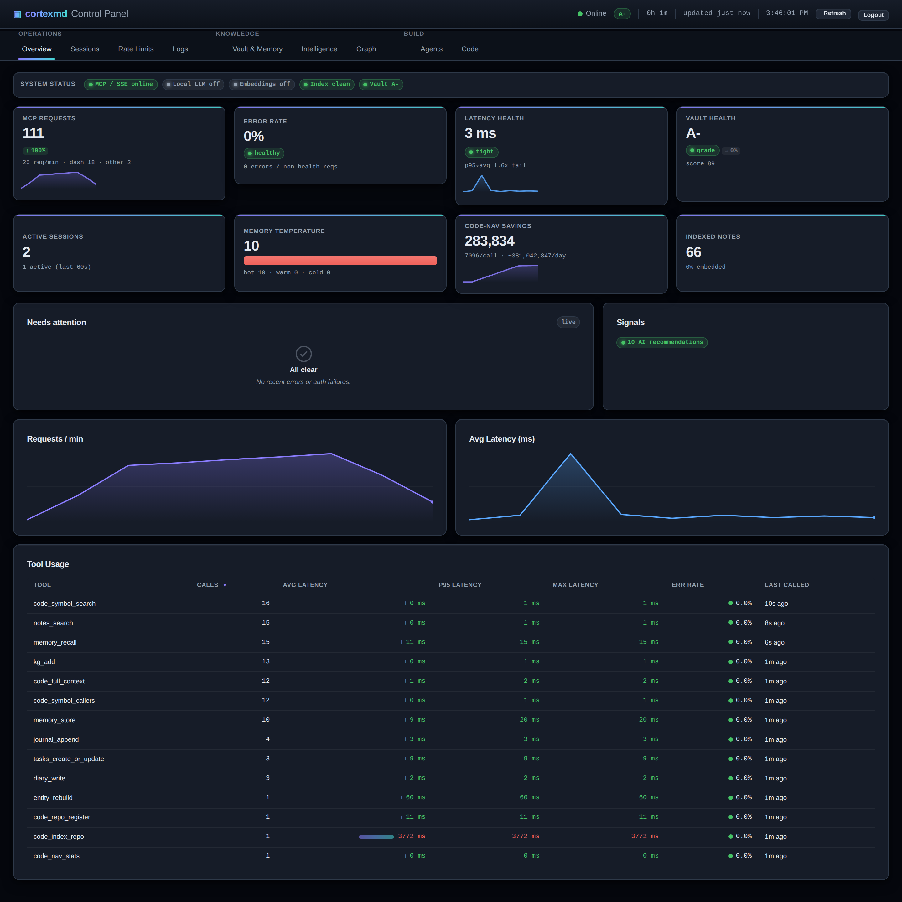
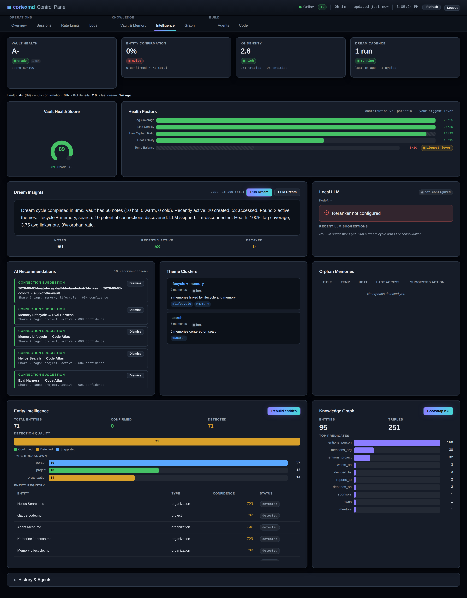
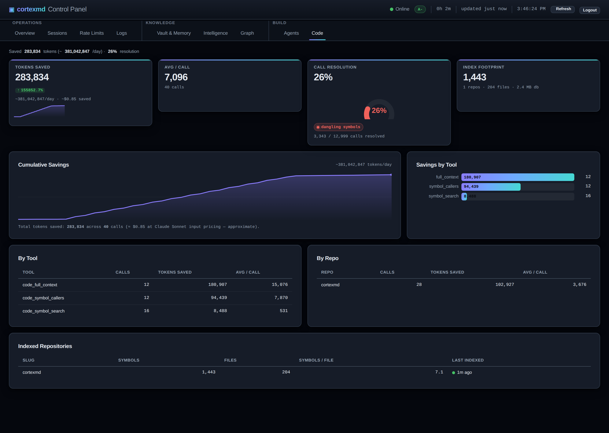
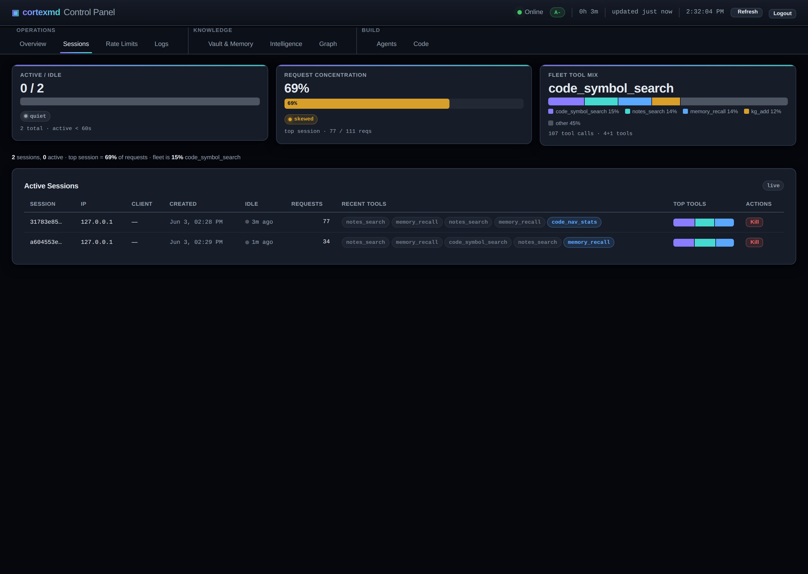
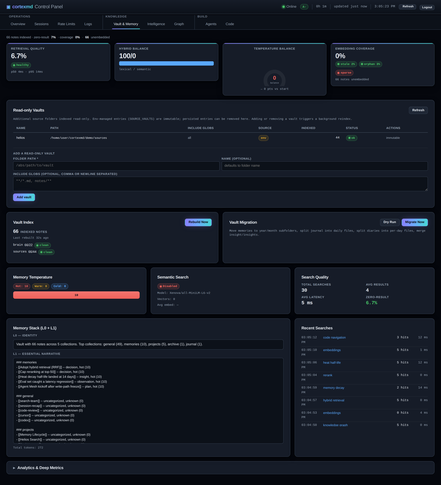
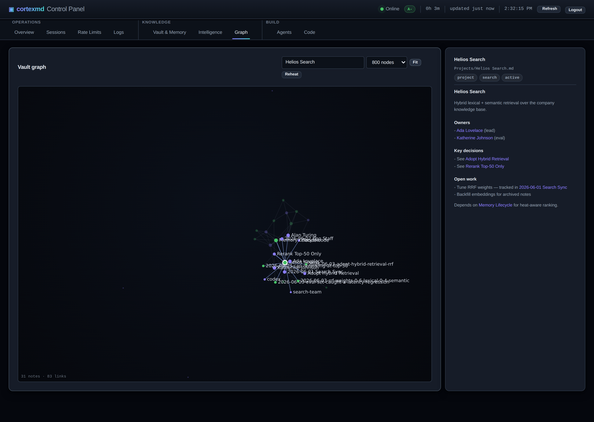
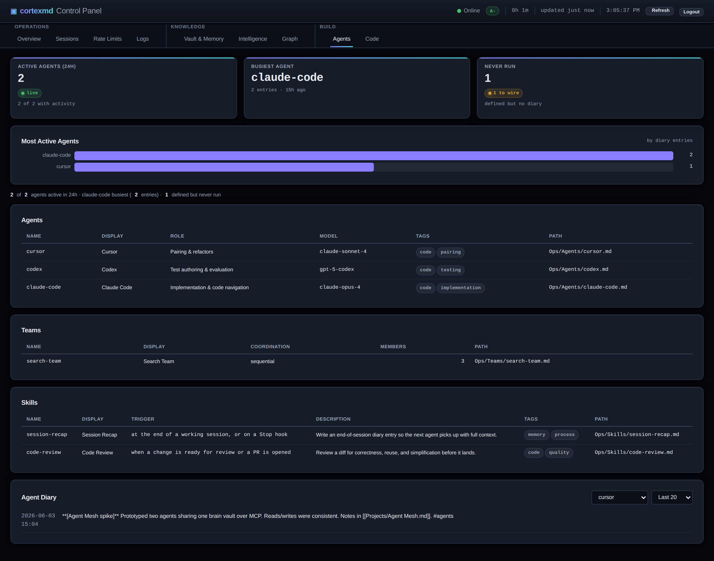
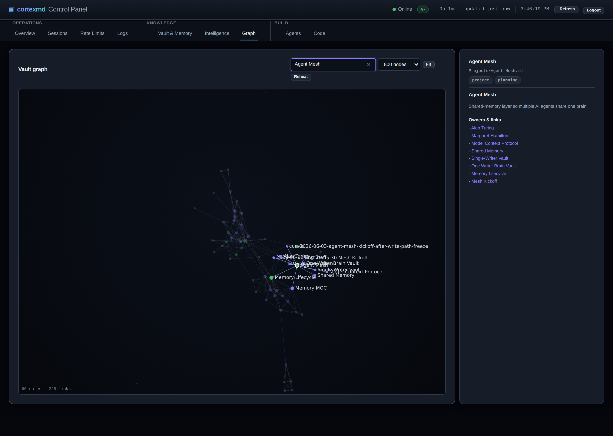

# cortexmd

> **Status: pre-alpha.** APIs, paths, and config names are still in flux and not yet stable. Not yet recommended for production use.

**cortexmd** is a long-term memory and code-navigation brain for AI agents, exposed over the [Model Context Protocol (MCP)](https://modelcontextprotocol.io). It indexes your code and notes, stores agent memories with a heat/decay lifecycle, runs hybrid (lexical + semantic) search, and serves cheap code-navigation tools (symbol search, call graph, change-impact) so agents stop burning tokens on whole-file reads.



## Why cortexmd

**The agent's memory is a real vault you can open, read, and edit.** Everything
cortexmd writes — memories, decisions, journal, agent diaries, knowledge-graph
notes — is plain Markdown with `[[wikilinks]]` and YAML frontmatter. So the same
brain your AI uses is a first-class [Obsidian](https://obsidian.md) vault: open
it, browse it, fix a fact, follow a link. No opaque database, no lock-in — if you
walked away tomorrow, you'd still have a tidy folder of notes.

**You can *see* how everything connects.** Because the notes are wiki-linked,
the relationships render as a graph — in Obsidian's graph view, and in
cortexmd's own dashboard (the Graph tab, below). People ↔ projects ↔ decisions ↔
concepts become a map you can actually navigate instead of a flat pile of files.

**The agent gets smarter between sessions.** Every session writes back what it
learned — decisions made, things observed, how the codebase fits together — and
recalls it next time. Context compounds instead of resetting at each new chat,
and a heat/decay lifecycle keeps what matters hot while the rest cools and
archives itself. Run it in server mode and that one growing brain is shared
across all your AI tools (Claude Code, Cursor, Codex), so they teach each other.

## Try it in 60 seconds (live dashboard)

The richest way to see cortexmd is the **server (shared-memory) mode**: one HTTP
server that every AI tool connects to, with a live operations dashboard. When you
want a single brain shared across Claude Code, Cursor, and Codex, this is the way
— memory written by one tool is instantly recalled by the others.

```sh
./demo/run.sh
```

This builds the server, starts it on `http://localhost:7777`, and seeds it with
realistic data by driving the MCP tools exactly like a real agent would. Then
open **http://localhost:7777/dashboard** (password: `demo`). See
[`demo/README.md`](./demo/README.md) for details, knobs, and how to point your
own AI tools at the running server.

| Knowledge graph & memory health | Code-nav token savings | Shared sessions |
|---|---|---|
| [](./docs/screenshots/intelligence.png) | [](./docs/screenshots/code.png) | [](./docs/screenshots/sessions.png) |
| [](./docs/screenshots/vault.png) | [](./docs/screenshots/graph.png) | [](./docs/screenshots/agents.png) |

Click any node in the graph to read the note and light up its neighbourhood —
here, the shared-memory subgraph around `Agent Mesh`:

[](./docs/screenshots/graph-selected.png)

## Two deployment modes (co-equal)

1. **local-stdio** — runs on your machine, talks MCP over stdio, reads your vault(s) directly from disk. No sync, no Docker, no auth, no network. This is the recommended default for individual use.
2. **self-hosted HTTP** *(advanced)* — the existing Express + OAuth2 / Authelia path, for multi-client or remote setups. Source vaults are pulled read-only on an interval (git/WebDAV/S3 via the `IVault` seam).

## The brain-vault model

cortexmd OWNS a separate **brain vault** — the only thing it ever writes to (memories, journal, agent diaries, tasks, knowledge-graph notes, `code-repos.json`). Your private vaults are attached as **read-only source vaults**: indexed for search and code-nav, never modified. Data flows one way, which removes the bidirectional-sync / clobber hazard entirely — the server is the sole writer.

```
  SOURCE_VAULTS[]  (read-only, opt-in, allowlisted)
  ┌───────────┐  ┌───────────┐  ┌───────────┐
  │  notes/   │  │  code/    │  │  docs/    │
  └─────┬─────┘  └─────┬─────┘  └─────┬─────┘
        │  index (one-way, read)      │
        └──────────────┼──────────────┘
                       ▼
              ┌──────────────────┐
              │     cortexmd     │   <- sole writer
              │   (MCP server)   │
              └────────┬─────────┘
                       │ writes
                       ▼
              ┌──────────────────┐
              │   BRAIN_VAULT    │   memories · journal · diaries
              │ (own dir, not    │   tasks · KG notes · code-repos.json
              │  your vault)     │
              └──────────────────┘
```

Default `BRAIN_VAULT` is a non-vault data dir (e.g. `~/.local/share/cortexmd/brain`), **never** your Obsidian vault.

## Monorepo layout

```
cortexmd/
├── packages/server/   TypeScript MCP server (Node 22, ESM, Express, search, memory)
├── crates/cli/        Rust indexer + CLI client / hooks / HUD  (one binary: cortexmd-cli)
├── contract/          Shared wire format + symbol-ID spec + golden fixtures (the seam)
├── docs/              Architecture & design docs
└── .github/workflows/ CI: TS build, Rust build/test, contract parity check
```

The project is **polyglot**: two toolchains (TS + Rust) glued by CI, kept honest by `contract/`.

## Quick start (local-stdio)

This is the recommended path for individual use: zero config, no auth, no
network, no Docker, no sync.

```sh
# 1. build the server (Node 22)
cd packages/server && npm ci && npm run build

# 2. run it over stdio, reading one of your vaults read-only.
#    BRAIN_VAULT defaults to a per-user data dir if omitted
#    (~/.local/share/cortexmd/brain, %LOCALAPPDATA%\cortexmd\brain on Windows).
BRAIN_VAULT=~/.local/share/cortexmd/brain \
SOURCE_VAULTS=/path/to/your/vault \
node dist/index.js --stdio
```

Register it with your MCP client (Claude Code / Cursor / Codex) as an **stdio**
server pointing at that command. Tools appear under `mcp__cortexmd__*`.

Then index a repo for code-nav with the Rust CLI:

```sh
cd crates/cli && cargo build --release
./target/release/cortexmd /path/to/some/repo      # index a repo
./target/release/cortexmd scan /path/to/dev-root  # walk + index every git repo
./target/release/cortexmd --help
```

Full walkthrough — install, source-vault `name=path:globs` syntax, optional
features — in [`docs/deploy-local.md`](./docs/deploy-local.md).

### Optional features

All off-by-default-friendly; none required for a working local install.

| Env var | Default | Effect |
|---------|---------|--------|
| `ENABLE_EMBEDDINGS` | `true` | Semantic search. Set `false` for a lexical-only fast path (skips the first-run model download) on low-resource machines. |
| `ENABLE_RERANKER` | `false` | Optional LLM reranker; no default host/model. |
| `DREAM_SCHEDULE` | (empty) | Cron expression for memory "dream" consolidation. |

See [`packages/server/.env.example`](./packages/server/.env.example) for the
authoritative list.

## Advanced: self-hosted HTTP

For multi-client or remote setups: Express over HTTP with API-key or OAuth2
auth, source vaults pulled read-only over a transport (git/WebDAV/S3). This is
the advanced path — most users want local-stdio above.

```sh
cd packages/server && npm ci && npm run build
BRAIN_VAULT=/data/brain SOURCE_VAULTS=/data/sources/notes API_KEY=$(openssl rand -hex 32) \
node dist/index.js   # serves MCP on :3000 with Bearer-token auth
```

See [`docs/deploy-http.md`](./docs/deploy-http.md) for auth (API key / OAuth /
optional forward-auth), reverse-proxy setup, and `SOURCE_VAULTS` over git-pull.

## Docs

- [`docs/deploy-local.md`](./docs/deploy-local.md) — local-stdio quickstart (start here)
- [`docs/deploy-http.md`](./docs/deploy-http.md) — self-hosted HTTP (advanced / team)
- [`docs/brain-vault.md`](./docs/brain-vault.md) — the sole-writer / read-only-source model
- [`docs/transports.md`](./docs/transports.md) — the `IVault` seam (Local / git / WebDAV / S3)
- [`docs/ARCHITECTURE.md`](./docs/ARCHITECTURE.md) — overall design
- [`packages/server/README.md`](./packages/server/README.md) — server env-var reference

## License

MIT — see [LICENSE](./LICENSE).
